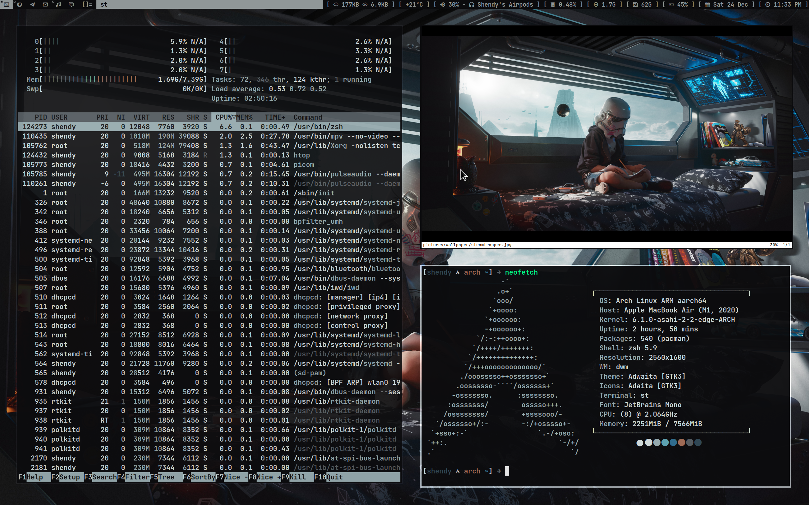

[asahi@linux] \
[asahi](https://asahilinux.org)

[Window Manager] \
[suckless](https://github.com/shendypratamaa/suckless)

[Editor] \
[nvim](https://github.com/shendypratamaa/nvim-base)

[installer] \
[shendypratamaa/asahi-install](https://github.com/shendypratamaa/asahi-install)
